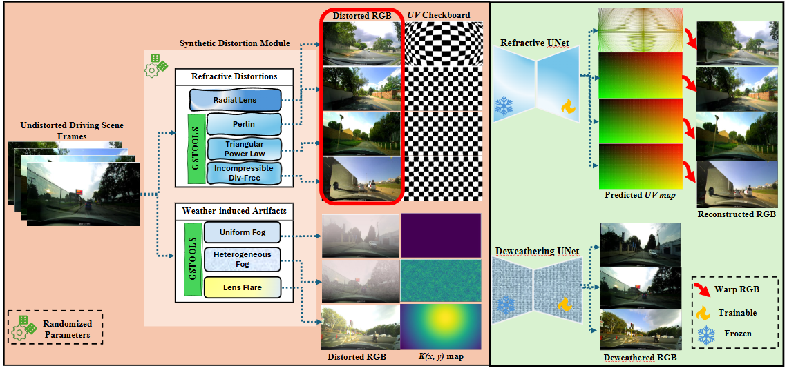
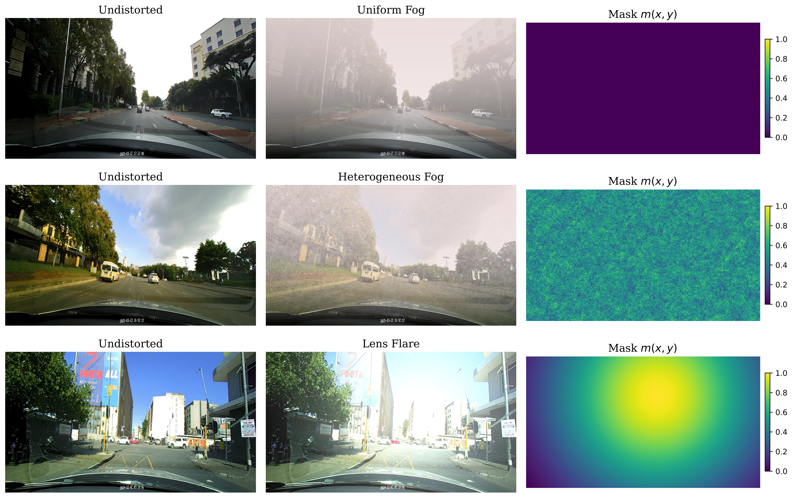
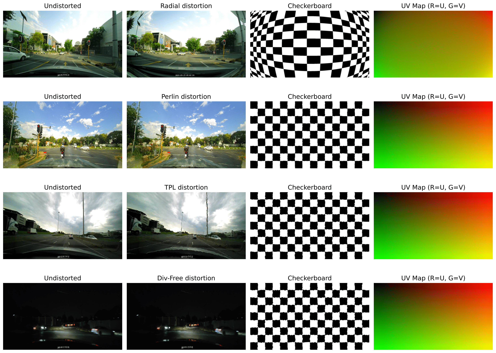

# RefraWeather-Sim
**Simulating Refractive Distortions & Weather-Induced Artifacts for Resource-Constrained Autonomous Perception (ICCV CV4DC Workshop 2025)**  

<p align="center">
  
</p>

<p align="center">
  <a href="https://arxiv.org/abs/2507.05536"></a>
  
  
</p>

---

## 🔎 What’s inside
- **Simulation**: refractive distortions (radial, Perlin, TPS, divergence-free) + weather (uniform/hetero fog, lens flare).
- **Paired outputs**: clean ↔ corrupted, with UV flow (refractive) and alpha/transmission (weather).
- **Tiny baselines**: Refractive U-Net (UV flow) and De-weather U-Net (RGB→RGB).
- **Quick metrics**: PSNR / EPE on synthetic pairs.

---

## Distortions

### Photometric: Synthetic Fog & Lens Flare

<div align="center">
  
  <br/>
  <em>Photometric distortions (fog & lens flare)</em>
</div>

<br/>

### Geometric: Refractive Lens Distortions

<div align="center">
  
  <br/>
  <em>Geometric (refractive) distortions</em>
</div>


---

## ⚡️ Quickstart
```bash
git clone https://github.com/your-org/RefraWeather-Sim.git
cd RefraWeather-Sim
python -m venv .venv && source .venv/bin/activate
pip install -r requirements.txt   # or: pip install -e .

# Data (undistorted frames)
# data/raw/VID_0001/images/000001.jpg

# Simulate refractive artifacts
python -m refraweather.sim.run_distortions \
  --input-root data/raw --output-root data/sim/refractive \
  --config configs/sim_refractive.yaml

# Simulate weather artifacts
python -m refraweather.sim.run_weather \
  --input-root data/raw --output-root data/sim/weather \
  --config configs/sim_weather.yaml

# Train compact restorers
python -m refraweather.train.train_refractive \
  --data-root data/sim/refractive \
  --config configs/train_refractive_unet.yaml --out runs/refr_unet

python -m refraweather.train.train_deweather \
  --data-root data/sim/weather \
  --config configs/train_deweather_unet.yaml --out runs/dew_unet

# Evaluate
python -m refraweather.eval.psnr_epe --data-root data/sim/refractive --ckpt runs/refr_unet/best.ckpt
python -m refraweather.eval.psnr     --data-root data/sim/weather    --ckpt runs/dew_unet/best.ckpt
```

-----

## File Structure

```bash
RefraWeather-Sim/
├─ configs/
│  ├─ sim_refractive.yaml
│  ├─ sim_weather.yaml
│  ├─ train_refractive_unet.yaml
│  └─ train_deweather_unet.yaml
├─ data/
│  ├─ raw/                      # undistorted input frames
│  └─ sim/
│     ├─ refractive/            # images_clean/, images_distorted/, uv_maps/, meta.json
│     └─ weather/               # images_clean/, images_corrupted/, alpha_maps/, meta.json
├─ refraweather/
│  ├─ __init__.py
│  ├─ sim/
│  │  ├─ run_distortions.py
│  │  ├─ run_weather.py
│  │  ├─ distortions/
│  │  │  ├─ radial.py
│  │  │  ├─ perlin.py
│  │  │  ├─ tps.py
│  │  │  └─ divfree.py
│  │  └─ weather/
│  │     ├─ uniform_fog.py
│  │     ├─ hetero_fog.py
│  │     └─ lens_flare.py
│  ├─ models/
│  │  └─ unet.py 
│  ├─ train/
│  │  ├─ train_refractive.py
│  │  └─ train_deweather.py
│  └─ eval/
│     ├─ psnr.py
│     └─ psnr_epe.py
├─ requirements.txt
└─ README.md
```

## 📜 Citation

```bibtex
@article{motsoehli2025refraweather,
  title   = {Simulating Refractive Distortions and Weather-Induced Artifacts for Resource-Constrained Autonomous Perception},
  author  = {Mots'oehli, Moseli and Chen, Feimei and Chan, Hok Wai and Tlali, Itumeleng and Babeli, Thulani and Baek, Kyungim and Chen, Huaijin},
  journal = {arXiv preprint arXiv:2507.05536},
  year    = {2025}
}
```

